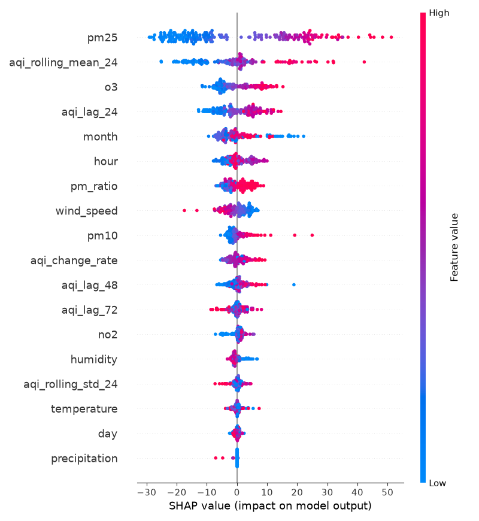
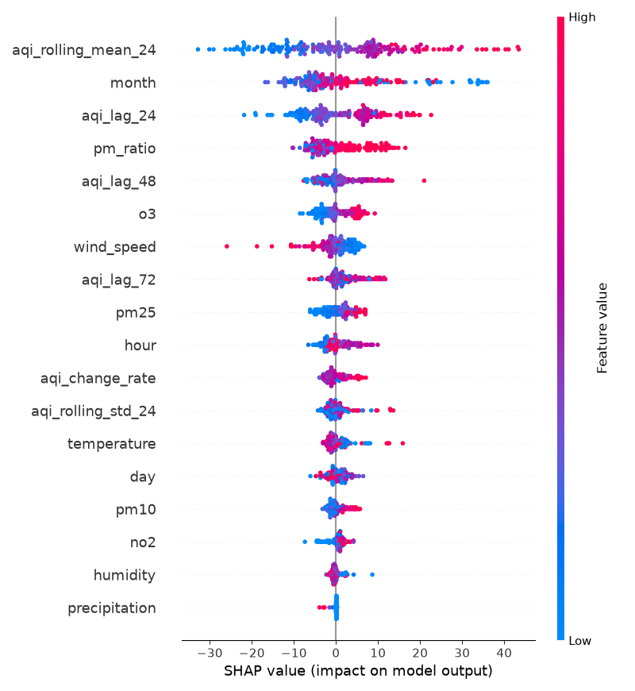
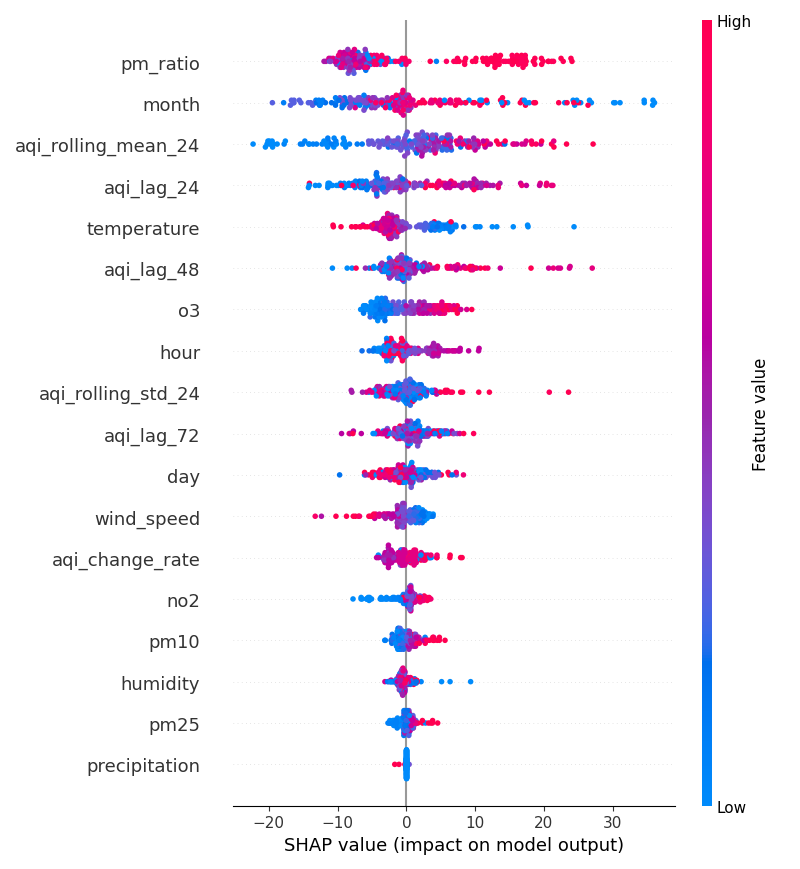
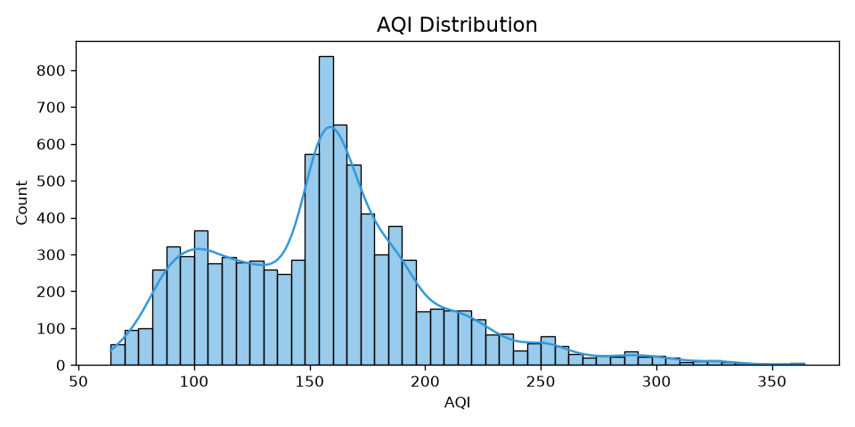
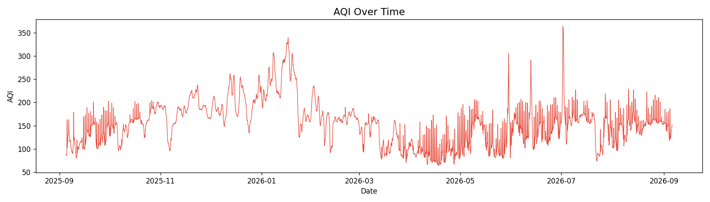
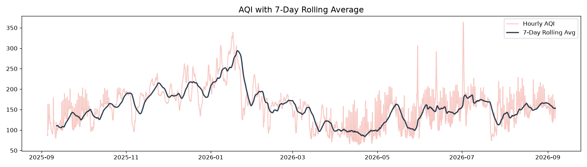
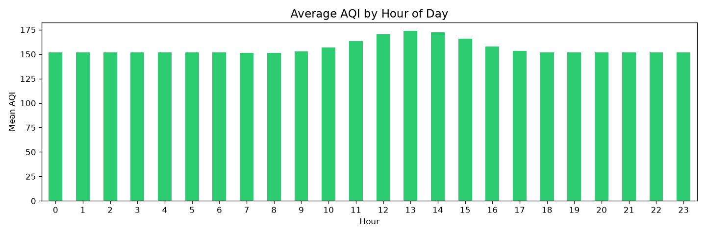
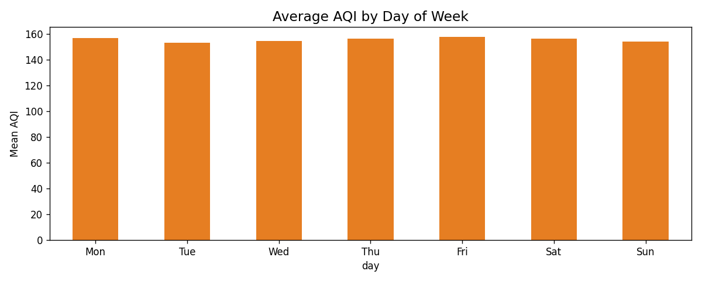
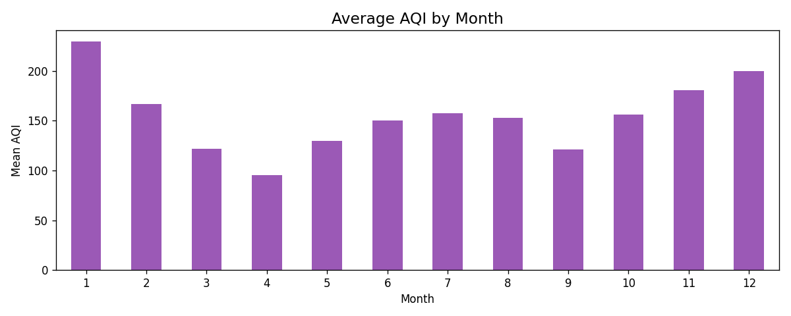
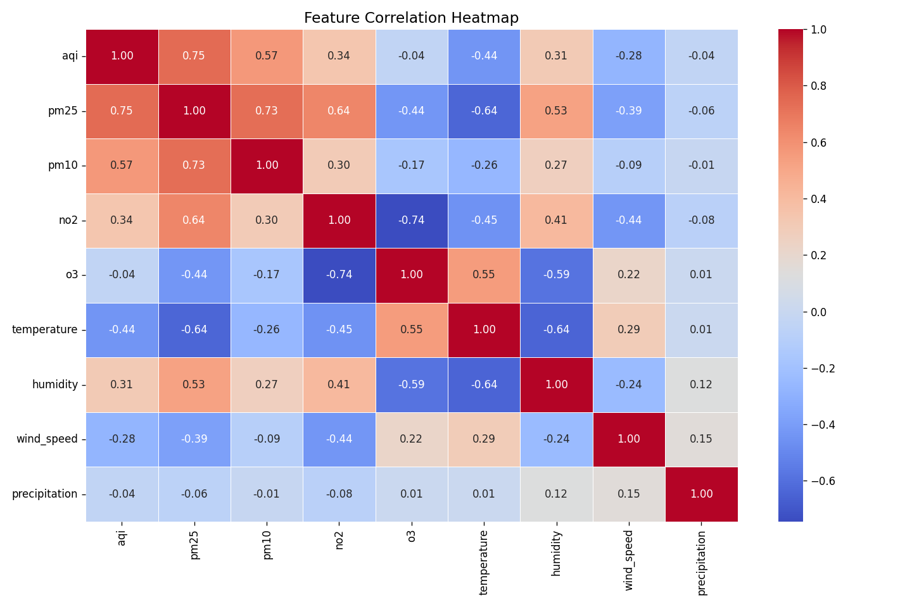

# AQI Prediction System — Project Report

---

## 1. Introduction

### 1.1 Background
Pakistan is a nation deeply intertwined with climate change and global warming. Presently, it most commonly takes the form of smog, especially strong during wintertime. Hence, the problem of predicting air quality and preventing lasting health effects becomes more important than ever.

### 1.2 Problem Statement
AQI or Air Quality Index measures the overall cleanliness of the air and how much pollution is present, translating raw pollutant concentrations into a simple score from 0 to 500 that reflects potential health risks (IQAir). Countries in the Global South often face the issue of worse air quality as compared to other nations, eventually posing a health risk in the long term. Accordingly, the issue of predicting air quality becomes more prevalent in face of the various factors that contribute to it.

### 1.3 Objectives
- Predict the Air Quality Index (AQI) for Lahore 3 days ahead using a fully serverless ML pipeline.
- Automate data collection, model training, and forecasting using GitHub Actions.
- Deploy an interactive dashboard to visualise real-time (forecasted) and predicted AQI values.

### 1.4 Scope
This project predicts AQI for Lahore, Pakistan for the next 3 days, taking into account the various environmental factors that contribute to it and the precautions that should be taken. The scope of this project is limited to a single city prediction and for only the next 72 hours. It showcases a scalable, automated pipeline continously collecting data and training machine learning models as well as an interactive dashboard showcasing real-time and forecasted AQI data.

---

## 2. System Architecture

### 2.1 High-Level Overview
The system is composed of four main components running on a serverless stack:
1. **Feature Pipeline** — fetches raw data and stores engineered features hourly.
2. **Backfill Pipeline** — populates the feature store with historical data for model training.
3. **Training Pipeline** — trains, evaluates, and registers the best ML model daily.
4. **Web Application** — loads the model and features to serve forecasts on a dashboard.

### 2.2 Technology Stack
| Component | Tool / Service |
|---|---|
| Weather & AQI Data | Open-Meteo API |
| Feature Store | Supabase |
| Orchestration | GitHub Actions |
| Web App | Streamlit |

---

## 3. Data

### 3.1 Data Sources
- **Open-Meteo Weather API** — temperature, humidity, wind speed, precipitation (hourly).
- **Open-Meteo Air Quality API** — US AQI, PM2.5, PM10, NO₂, O₃ (hourly).

### 3.2 Features Engineered

A total of 18 features are computed and stored per hourly record. They fall into four categories:

#### Time Features
| Feature | Description |
|---|---|
| `hour` | Hour of the day (0–23). Captures intra-day AQI cycles — pollution typically peaks during morning and evening rush hours. |
| `day` | Day of the week (0 = Monday, 6 = Sunday). Captures weekday vs. weekend traffic and industrial activity patterns. |
| `month` | Month of the year (1–12). Captures seasonal variation — Lahore's AQI worsens significantly in winter months due to temperature inversions and crop burning. |

#### AQI Lag & Rolling Features
These are derived from the historical AQI values already stored in the feature store and give the model memory of recent air quality trends.

| Feature | Description |
|---|---|
| `aqi_change_rate` | Difference between the current hour's AQI and the previous hour's AQI. Captures the direction and momentum of change (positive = worsening, negative = improving). |
| `aqi_lag_24` | AQI value from exactly 24 hours ago. Strong predictor due to daily periodicity in pollution patterns. |
| `aqi_lag_48` | AQI value from 48 hours ago. Provides a two-day lookback for medium-term trend awareness. |
| `aqi_lag_72` | AQI value from 72 hours ago. Extends the lookback window to capture three-day patterns. |
| `aqi_rolling_mean_24` | Mean AQI over the past 24 hours. Smooths out short-term spikes and represents the baseline pollution level going into the forecast. |
| `aqi_rolling_std_24` | Standard deviation of AQI over the past 24 hours. Measures how volatile or stable air quality has been — high variability can signal an incoming pollution event. |

#### Pollutant Concentrations
Raw pollutant readings fetched from the Open-Meteo Air Quality API.

| Feature | Description |
|---|---|
| `pm25` | Concentration of fine particulate matter with diameter ≤ 2.5 µm (µg/m³). The primary driver of AQI in Lahore and the most health-relevant pollutant — penetrates deep into lung tissue. |
| `pm10` | Concentration of coarse particulate matter with diameter ≤ 10 µm (µg/m³). Includes dust, pollen, and combustion particles. |
| `no2` | Nitrogen dioxide concentration (µg/m³). Produced by vehicle exhaust and industrial combustion. Used as a proxy for traffic-related pollution. |
| `o3` | Ozone concentration (µg/m³). Ground-level ozone forms through photochemical reactions and is higher during hot, sunny days. |
| `pm_ratio` | Ratio of PM2.5 to PM10 (`pm25 / pm10`). A high ratio (close to 1.0) indicates pollution dominated by fine particles, typically from combustion sources (vehicles, burning). A low ratio suggests coarser sources like dust. |

#### Meteorological Features
Fetched from the Open-Meteo Weather API. Weather conditions directly affect how pollutants disperse or accumulate.

| Feature | Description |
|---|---|
| `temperature` | Air temperature in °C. Higher temperatures can increase ozone formation; cooler temperatures with inversions trap pollutants near the ground. |
| `humidity` | Relative humidity (%). High humidity causes particulate matter to absorb moisture and swell, increasing PM readings and AQI. |
| `wind_speed` | Wind speed in km/h. Higher wind speeds disperse pollutants and lower AQI; calm conditions allow accumulation. |
| `precipitation` | Rainfall in mm. Rain washes particulates out of the atmosphere, typically causing a sharp temporary drop in AQI. |

### 3.3 Target Variable
The model predicts Air Quality Index levels for the next 24 hours, the next 48 hours, and the next 72 hours. 

### 3.4 Exploratory Data Analysis (EDA)
During EDA, some trends were found in the measures of AQI throughout the year. Typically, AQI spiked mainly during colder months starting from December to February due to more concentrated smog and probably other environmental factors. The most common AQI value is usually 151-152 which can be observed at multiple times thorughout the year. There isn't too much variation between AQI during different hours of the day, however it does tend to slightly more often peak during the afternoon (11am - 4pm). The top 3 features most positively correlated with a higher AQI are PM25, PM10, and NO₂. While the feautres most negative correlated are temperature, wind speed, and O₃.  

Other Observations:
- NO₂ and O₃ have the strongest negative relationship, suggesting that higher NO₂ levels tend to coincide with lower O₃ levels.
- PM2.5 decreases as temperature increases, indicating that colder conditions are associated with higher PM2.5 concentrations.
- Temperature and humidity are strongly inversely related: warmer periods tend to have lower humidity.
- AQI is negatively correlated with temperature (−0.44), suggesting poorer air quality tends to occur during cooler conditions.
- Wind speed has moderate negative correlations with NO₂ (−0.43) and PM2.5 (−0.38), potentially indicating pollutant dispersion at higher wind speeds.
- Precipitation has almost no correlation with the other features, with all correlations close to zero. (This doesn't make too much sense to me as rain can generally help improve AQI so there might be an issue with the data or a pattern not being read.)

### 3.5 Data Reasoning
The data is collected from a single API, OpenMeteo, as opposed to AQICN or OpenWeather due to extra steps in fetching the API or having incomplete data that would require further engineering for a well-designed model. Additionally, instead of a feature store like Hopsworks or Vertex AI, I opted to use Supabase which is an open-source Backend-as-a-Service (BaaS) platform. This was due to issues I saw others facing with limited calls to the suggested feature store in the free tier. In contrast, Supabase had no such limits for this project and is well designed for a small scale project to store a reasonable amount of data. 

While features such as temperature, humidity, wind speed etc. are the standard for any AQI prediction model, I incorporated features such as AQI change rate, AQI lag, and AQI rolling mean for a better prediction. This was necessary for more accurate predictions and moving away from a negative R^2 score, which was an issue I faced in the beginning for even the 24-hour prediction.

OpenMeteo API is also a forecast, not current conditions. So, oftentimes, the current temperature or AQI tends to be overestimated/underestimated compared to actual live conditions.

---

## 4. Feature Pipeline

### 4.1 Design
The feature pipeline runs **every hour** via a GitHub Actions cron job. It fetches the current hour's weather and air quality data, engineers the features listed above, and upserts the row into Supabase, skipping the insert if a record for that timestamp already exists to prevent duplicates.

### 4.2 Timezone Handling
All timestamps are stored in **Pakistan Standard Time (PKT, UTC+5)** using Python's `timezone(timedelta(hours=5))`. This ensures the hour index used to query the API and the timestamp written to the feature store are always consistent, regardless of the UTC environment on GitHub Actions.

### 4.3 Challenges & Fixes
A big issue I faced was properly populating the online feature store with the correct records of data. Oftentimes, some dates or hours were missing so I needed to manually inspect the last few records and figure out what was going wrong in the code (e.g. timezone). Additionally, while training the models my value for R^2 often ended up being negative, which can indicate that a machine learning model performs worse than simply predicting the average (mean) of the target data. In an effort to increase that value, I first added more features such as lag and rolling average to give more temporal information to the machine learning model. I also performed a comparison between 1 to 3 years of data used for training the model (see below). 

```
==================================================
Training for Day 1 (24h ahead)
==================================================
Fetching data for last 1 year(s)...
Rows after 1yr filter: 8735
[1yr] Persistence Baseline      → RMSE: 45.04 | MAE: 36.07 | R²: -0.731
Ridge Regression          → RMSE: 29.90 | MAE: 21.44 | R²: 0.237
Random Forest             → RMSE: 26.91 | MAE: 18.27 | R²: 0.382
XGBoost                   → RMSE: 26.45 | MAE: 17.65 | R²: 0.403
XGBoost Tuned             → RMSE: 25.62 | MAE: 17.40 | R²: 0.440
LightGBM                  → RMSE: 26.95 | MAE: 18.32 | R²: 0.380
Best model: XGBoost Tuned
✅ [1yr] Beats persistence baseline (RMSE 25.62 < 45.04)
Fetching data for last 2 year(s)...
Rows after 2yr filter: 8761
[2yr] Persistence Baseline      → RMSE: 34.27 | MAE: 23.31 | R²: -0.004
Ridge Regression          → RMSE: 29.76 | MAE: 21.34 | R²: 0.243
Random Forest             → RMSE: 27.09 | MAE: 18.27 | R²: 0.372
XGBoost                   → RMSE: 25.99 | MAE: 17.40 | R²: 0.422
XGBoost Tuned             → RMSE: 25.93 | MAE: 17.39 | R²: 0.425
LightGBM                  → RMSE: 26.71 | MAE: 18.14 | R²: 0.390
Best model: XGBoost Tuned
✅ [2yr] Beats persistence baseline (RMSE 25.93 < 34.27)
Fetching data for last 3 year(s)...
Rows after 3yr filter: 8761
[3yr] Persistence Baseline      → RMSE: 34.27 | MAE: 23.31 | R²: -0.004
Ridge Regression          → RMSE: 29.76 | MAE: 21.34 | R²: 0.243
Random Forest             → RMSE: 27.09 | MAE: 18.27 | R²: 0.372
XGBoost                   → RMSE: 25.99 | MAE: 17.40 | R²: 0.422
XGBoost Tuned             → RMSE: 25.93 | MAE: 17.39 | R²: 0.425
LightGBM                  → RMSE: 26.71 | MAE: 18.14 | R²: 0.390
Best model: XGBoost Tuned
✅ [3yr] Beats persistence baseline (RMSE 25.93 < 34.27)
🏆 Best for Day 1: XGBoost Tuned trained on 1 year(s) of data (RMSE: 25.62)
Computing SHAP for Day 1...
SHAP plot saved for Day 1
==================================================
Training for Day 2 (48h ahead)
==================================================
Fetching data for last 1 year(s)...
Rows after 1yr filter: 8735
[1yr] Persistence Baseline      → RMSE: 49.22 | MAE: 40.23 | R²: -1.068
Ridge Regression          → RMSE: 37.72 | MAE: 26.95 | R²: -0.215
Random Forest             → RMSE: 35.31 | MAE: 25.06 | R²: -0.065
XGBoost                   → RMSE: 34.97 | MAE: 25.12 | R²: -0.044
XGBoost Tuned             → RMSE: 35.53 | MAE: 25.08 | R²: -0.078
LightGBM                  → RMSE: 35.03 | MAE: 24.87 | R²: -0.047
Best model: XGBoost
✅ [1yr] Beats persistence baseline (RMSE 34.97 < 49.22)
Fetching data for last 2 year(s)...
Rows after 2yr filter: 8761
[2yr] Persistence Baseline      → RMSE: 40.83 | MAE: 31.85 | R²: -0.423
Ridge Regression          → RMSE: 37.29 | MAE: 26.61 | R²: -0.187
Random Forest             → RMSE: 35.15 | MAE: 25.13 | R²: -0.055
XGBoost                   → RMSE: 35.12 | MAE: 25.07 | R²: -0.053
XGBoost Tuned             → RMSE: 35.02 | MAE: 24.89 | R²: -0.047
LightGBM                  → RMSE: 35.59 | MAE: 25.31 | R²: -0.081
Best model: XGBoost Tuned
✅ [2yr] Beats persistence baseline (RMSE 35.02 < 40.83)
Fetching data for last 3 year(s)...
Rows after 3yr filter: 8761
[3yr] Persistence Baseline      → RMSE: 40.83 | MAE: 31.85 | R²: -0.423
Ridge Regression          → RMSE: 37.29 | MAE: 26.61 | R²: -0.187
Random Forest             → RMSE: 35.15 | MAE: 25.13 | R²: -0.055
XGBoost                   → RMSE: 35.12 | MAE: 25.07 | R²: -0.053
XGBoost Tuned             → RMSE: 35.02 | MAE: 24.89 | R²: -0.047
LightGBM                  → RMSE: 35.59 | MAE: 25.31 | R²: -0.081
Best model: XGBoost Tuned
✅ [3yr] Beats persistence baseline (RMSE 35.02 < 40.83)
🏆 Best for Day 2: XGBoost trained on 1 year(s) of data (RMSE: 34.97)
Computing SHAP for Day 2...
SHAP plot saved for Day 2
==================================================
Training for Day 3 (72h ahead)
==================================================
Fetching data for last 1 year(s)...
Rows after 1yr filter: 8735
[1yr] Persistence Baseline      → RMSE: 46.48 | MAE: 37.55 | R²: -0.844
Ridge Regression          → RMSE: 38.75 | MAE: 28.31 | R²: -0.282
Random Forest             → RMSE: 37.16 | MAE: 26.74 | R²: -0.179
XGBoost                   → RMSE: 37.75 | MAE: 27.28 | R²: -0.216
XGBoost Tuned             → RMSE: 37.29 | MAE: 27.27 | R²: -0.187
LightGBM                  → RMSE: 37.94 | MAE: 27.50 | R²: -0.228
Best model: Random Forest
✅ [1yr] Beats persistence baseline (RMSE 37.16 < 46.48)
Fetching data for last 2 year(s)...
Rows after 2yr filter: 8761
[2yr] Persistence Baseline      → RMSE: 49.93 | MAE: 40.93 | R²: -1.128
Ridge Regression          → RMSE: 38.49 | MAE: 28.11 | R²: -0.265
Random Forest             → RMSE: 36.96 | MAE: 26.51 | R²: -0.166
XGBoost                   → RMSE: 37.38 | MAE: 27.01 | R²: -0.193
XGBoost Tuned             → RMSE: 37.18 | MAE: 27.10 | R²: -0.180
LightGBM                  → RMSE: 37.72 | MAE: 27.24 | R²: -0.215
Best model: Random Forest
✅ [2yr] Beats persistence baseline (RMSE 36.96 < 49.93)
Fetching data for last 3 year(s)...
Rows after 3yr filter: 8761
[3yr] Persistence Baseline      → RMSE: 49.93 | MAE: 40.93 | R²: -1.128
Ridge Regression          → RMSE: 38.49 | MAE: 28.11 | R²: -0.265
Random Forest             → RMSE: 36.96 | MAE: 26.51 | R²: -0.166
XGBoost                   → RMSE: 37.38 | MAE: 27.01 | R²: -0.193
XGBoost Tuned             → RMSE: 37.18 | MAE: 27.10 | R²: -0.180
LightGBM                  → RMSE: 37.72 | MAE: 27.24 | R²: -0.215
Best model: Random Forest
✅ [3yr] Beats persistence baseline (RMSE 36.96 < 49.93)
🏆 Best for Day 3: Random Forest trained on 2 year(s) of data (RMSE: 36.96)
```

Since neither 2 or 3 years of data significantly impacted the model, I opted to stick to 1 year of data for training. 

---

## 5. Training Pipeline
 
### 5.1 Data Preparation
 
Data is fetched from Supabase and filtered to the most recent 365 days to keep the model relevant to current pollution patterns. Rows are sorted chronologically by timestamp.
 
Several features are recomputed at training time from the raw `aqi` column to ensure consistency — lag features (`aqi_lag_24/48/72`), rolling statistics (`aqi_rolling_mean_24`, `aqi_rolling_std_24`), and `pm_ratio`. The target variable (`target_aqi`) is created by shifting the AQI column forward by the forecast horizon (24h, 48h, or 72h), so each row's features represent the current state and the target represents the AQI that many hours later. Rows with any missing values in the feature or target columns are dropped.
 
The dataset is split **80% training / 20% test** in chronological order (no shuffling) so the model is always tested on data it has never seen and that comes after its training window. No feature scaling is applied since all models used are tree-based or regularised regression, which do not require it. Time features (`hour`, `day`, `month`) are passed as raw integers; this works well for tree-based models which split on thresholds rather than distances.
 
A separate model is trained for each of the three forecast horizons: **Day 1 (24h)**, **Day 2 (48h)**, and **Day 3 (72h)**.
 
### 5.2 Models Evaluated
 
Five models are trained and evaluated for each forecast horizon:
 
| Model | Type | Notes |
|---|---|---|
| Ridge Regression | Linear | Baseline statistical model with L2 regularisation |
| Random Forest | Ensemble (bagging) | 200 trees, captures non-linear feature interactions |
| XGBoost | Gradient boosting | 300 estimators, learning rate 0.05, max depth 6 |
| XGBoost Tuned | Gradient boosting | 500 estimators, lower learning rate 0.03, conservative depth and sampling to reduce overfitting |
| LightGBM | Gradient boosting | 300 estimators, fast leaf-wise tree growth |
 
All models are also compared against a **persistence baseline**, a naive forecast that assumes the AQI at prediction time will equal the last known AQI value. A model is only saved if it beats this baseline by RMSE.

**XGBoost Tuned parameters vs base XGBoost:**

| Parameter | XGBoost | XGBoost Tuned |
|---|---|---|
| `n_estimators` | 300 | 500 |
| `learning_rate` | 0.05 | 0.03 |
| `max_depth` | 6 | 5 |
| `subsample` | 1.0 | ~0.8 |
| `colsample_bytree` | 1.0 | ~0.8 |

The tuning strategy was to make the model learn more slowly and conservatively. More trees with a lower learning rate means smaller steps over more iterations, which generalises better as no single tree overcorrects. Shallower depth reduces overfitting by limiting how complex each tree can be. Subsampling ~80% of rows and features per tree introduces randomness similar to Random Forest, preventing the model from memorising training data.
 
### 5.3 Evaluation Metrics
 
| Metric | Description |
|---|---|
| RMSE | Root Mean Squared Error — penalises large errors more heavily; primary selection metric |
| MAE | Mean Absolute Error — average magnitude of error in AQI units; easier to interpret |
| R² | Coefficient of Determination — proportion of AQI variance explained by the model (1.0 = perfect) |
 
The best model per forecast day is selected by lowest RMSE on the held-out test set.
 
### 5.4 Results
 ```
============================================================
Training model for Day 1 (24h ahead)
============================================================
Persistence Baseline      → RMSE: 40.28 | MAE: 31.38 | R²: -0.436
------------------------------------------------------------
Ridge Regression          → RMSE: 29.67 | MAE: 21.23 | R²: 0.221
Random Forest             → RMSE: 27.08 | MAE: 18.36 | R²: 0.351
XGBoost                   → RMSE: 26.08 | MAE: 17.70 | R²: 0.398
XGBoost Tuned             → RMSE: 25.56 | MAE: 17.25 | R²: 0.422
LightGBM                  → RMSE: 26.43 | MAE: 17.77 | R²: 0.382


============================================================
Training model for Day 2 (48h ahead)
============================================================
Persistence Baseline      → RMSE: 37.81 | MAE: 28.57 | R²: -0.263
------------------------------------------------------------
Ridge Regression          → RMSE: 37.43 | MAE: 26.65 | R²: -0.238
Random Forest             → RMSE: 35.04 | MAE: 24.87 | R²: -0.085
XGBoost                   → RMSE: 34.88 | MAE: 24.70 | R²: -0.075
XGBoost Tuned             → RMSE: 34.47 | MAE: 24.22 | R²: -0.049
LightGBM                  → RMSE: 34.59 | MAE: 24.29 | R²: -0.057


============================================================
Training model for Day 3 (72h ahead)
============================================================
Persistence Baseline      → RMSE: 35.22 | MAE: 25.11 | R²: -0.093
------------------------------------------------------------
Ridge Regression          → RMSE: 38.12 | MAE: 27.76 | R²: -0.281
Random Forest             → RMSE: 37.00 | MAE: 27.14 | R²: -0.207
XGBoost                   → RMSE: 37.09 | MAE: 26.93 | R²: -0.213
XGBoost Tuned             → RMSE: 36.63 | MAE: 26.66 | R²: -0.183
LightGBM                  → RMSE: 37.81 | MAE: 27.48 | R²: -0.260
 ```
### 5.5 Best Model
 
Models are chosen everyday after training on the updated data is done. Each day has its own model since predicting 1 day ahead obviously differs from predicting 2 or 3 days ahead. The most commonly picked model is XGBoost tuned with specific parameters over all the other models. Although, sometimes LightGBM or RandomForest ends up being chosen.
 
The best-performing model varies by forecast horizon. Generally, gradient boosting models (XGBoost or LightGBM) are expected to outperform Ridge Regression for this task because AQI prediction is non-linear — pollution levels are shaped by threshold effects (e.g. wind speed above a certain level disperses pollutants sharply) and interaction effects between features (e.g. high humidity combined with low wind speed compounds PM2.5 accumulation). Ridge Regression treats all features as having an additive linear effect, which is a poor fit for these dynamics and is also disadvantaged by the raw integer encoding of time features.
 
The best model for each day is saved to `models/model_day{N}.pkl` along with its name in `models/model_day{N}_name.txt`, and is visible in the dashboard's Model Registry page.
 
### 5.6 Feature Importance (SHAP)
 
SHAP (SHapley Additive exPlanations) values are computed after training using a sample of up to 200 training rows via `shap.TreeExplainer`. SHAP assigns each feature a contribution value for each prediction — positive values push the predicted AQI higher, negative values push it lower.
 
The top 8 features by mean absolute SHAP value are saved per forecast day as both a summary plot (`models/shap/shap_day{N}.png`) and a JSON file (`models/shap/shap_day{N}.json`) for rendering natively in the dashboard.
 
Expected findings based on the feature set:
- **`aqi_lag_24`**, **`aqi_rolling_mean_24`**, and **`aqi_lag_48`** are likely the dominant features as recent AQI history is the strongest predictor of near-future AQI.
- **`pm25`** and **`pm_ratio`** are expected to rank highly as they are the primary chemical drivers of the US AQI value.
- **`wind_speed`** and **`humidity`** should show meaningful importance as key meteorological dispersal and accumulation factors.
- **`hour`** and **`month`** are expected to have moderate importance, capturing daily and seasonal cycles.
- **`precipitation`** may show low mean importance but high impact in the subset of hours where it is non-zero, since rainfall events cause sharp AQI drops.

---

## 6. Automation (CI/CD)
 
### 6.1 GitHub Actions Workflows
| Workflow | Schedule | Purpose |
|---|---|---|
| `feature_pipeline.yml` | Every hour (`0 * * * *` UTC) | Fetch and store latest features in Supabase |
| `training.yml` | Daily at 02:00 UTC / 07:00 PKT (`0 2 * * *`) | Run EDA, retrain all models, commit updated files |
 
Both workflows support `workflow_dispatch`, allowing manual triggering from the GitHub Actions UI without waiting for the scheduled run.
 
### 6.2 Workflow Design
 
**Feature Pipeline (`feature_pipeline.yml`)**
 
Runs on `ubuntu-latest` with Python 3.11. Steps: checkout the repo → install a minimal dependency set (`requests`, `python-dotenv`, `supabase`) → run `notebooks/feature_pipeline.py`. The script handles duplicate prevention itself — it checks whether a row for the current PKT hour already exists in Supabase before inserting. No files are written back to the repo.
 
**Training Pipeline (`training.yml`)**
 
Runs on `ubuntu-latest` with a 60-minute timeout. Steps: checkout → install the full ML dependency stack → run `notebooks/eda.py` → run `notebooks/training.py` → commit any updated files in `models/` and `eda_plots/` back to the repo using the `github-actions[bot]` identity. The commit is skipped automatically if no files changed (`git diff --cached --quiet`), preventing empty commits.
 
**Secrets Management**
 
Both workflows access Supabase credentials exclusively through GitHub Actions encrypted secrets (`SUPABASE_URL`, `SUPABASE_KEY`), injected as environment variables at runtime. No credentials are stored in the codebase or committed to the repository.

**Issues**

Github doesn't run hourly pipelines at the right time due to some issues with queuing for Github Actions. For now the hourly feature pipeline runs every 2/3 hours. 

 
---
 
## 7. Web Application
 
### 7.1 Overview
 
The dashboard is built with **Streamlit** and deployed on **Streamlit Community Cloud**, making it publicly accessible with no infrastructure to manage. On load it fetches the current hour's weather and air quality data directly from the Open-Meteo APIs, builds the 18-feature input vector, loads the three trained `.pkl` model files from the `models/` directory committed by the daily training run, and computes Day 1, 2, and 3 AQI forecasts in real time.
 
### 7.2 Dashboard Features
 
The app is organised into six pages navigated via a sidebar:
 
| Page | Content |
|---|---|
| **Live Forecast** | Current AQI gauge, conditions strip (temperature, humidity, wind, rain), 4-day AQI timeline chart with colour-banded health zones, 3-day outlook cards, SHAP prediction breakdown per forecast day |
| **Health Tips** | Actionable health advice tailored to the current and forecasted AQI level |
| **SHAP Explanations** | Full SHAP summary plots for each of the three forecast models, showing feature impact distributions across the training sample |
| **EDA & Analysis** | 7 exploratory plots generated from the historical Supabase data during the daily training run |
| **Model Registry** | Shows which model won for each forecast day and when models were last updated |
| **Feature Guide** | Live table of all 18 feature values computed for the current hour, with descriptions |
 
### 7.3 AQI Alerts
 
A persistent alert banner is shown at the top of every page when the current AQI exceeds safe thresholds. It also checks whether any forecasted day is projected to reach the same level and appends a warning if so.
 
| Level | Trigger | Guidance Shown |
|---|---|---|
| Unhealthy | AQI > 150 | Everyone may begin to experience effects. Limit outdoor time, consider an N95 mask. |
| Very Unhealthy | AQI > 200 | Serious health effects for everyone. Avoid all outdoor activity. |
| Hazardous | AQI > 300 | Emergency conditions. Stay indoors, seal windows, avoid all outdoor exposure. |
 
---
 
## 8. Results & Discussion
 
### 8.1 Model Performance
 
Three separate models are deployed, one per forecast horizon. Performance is expected to degrade at longer horizons as uncertainty compounds — Day 1 should be most accurate, Day 3 least.
 
Since models differ for each day, I am refraining from stating which is best as they change from a day to day basis.
 
### 8.2 Key Findings
  
- Lahore's AQI follows a strong daily cycle, peaking during morning and evening rush hours and dipping in the early afternoon as temperature rises and convective mixing increases.
- AQI worsens significantly in winter months (November–January), consistent with temperature inversions trapping pollutants near the ground and seasonal crop residue burning in surrounding agricultural regions.
- PM2.5 is the dominant pollutant driving high AQI readings; `pm25` and `aqi_lag_24` are expected to rank as the top SHAP features across all three models.
- Wind speed has a strong negative relationship with AQI — even modest increases above ~10 km/h are associated with meaningful reductions in particulate concentration.
- Rainfall events cause sharp but short-lived AQI drops, visible within the same hour and largely dissipating within 6–12 hours.
### 8.3 Limitations
 
- **Lag feature source at inference:** The app builds `aqi_lag_24/48/72` from the Open-Meteo forecast API's projected AQI values rather than measured historical data. Errors in the API's own forecast propagate into the model's input features for Day 2 and Day 3 predictions.
- **No cyclical time encoding:** `hour`, `day`, and `month` are passed as raw integers. Tree-based models handle this adequately via threshold splits, but Ridge Regression cannot capture the wrap-around nature of time (e.g. hour 23 → hour 0), which disadvantages it relative to the other models.
- **Single location:** The system is scoped to Lahore (lat 31.5497, lon 74.3436). Generalising to other cities would require re-backfilling and retraining.
- **No null handling:** If the Open-Meteo API returns null values for a given hour, those nulls propagate into the feature store and can corrupt lag and rolling calculations for subsequent hours.
- **Model staleness risk:** Models are retrained daily on the past 365 days. A sudden out-of-distribution pollution event (e.g. an industrial incident) may not be well-predicted until sufficient new data is incorporated.
---
 
## 9. Conclusion
 
This project delivers a fully automated, serverless AQI prediction system for Lahore. A feature pipeline running every hour on GitHub Actions continuously ingests weather and air quality data from Open-Meteo and stores engineered features in Supabase. A daily training pipeline evaluates five machine learning models across three forecast horizons and commits the best-performing models to the repository. A Streamlit dashboard provides real-time AQI readings, 3-day forecasts, SHAP-based explanations, health alerts, and exploratory analysis, all updated automatically without manual intervention.
 
---
 
## 10. References
 
- Open-Meteo Weather API — https://open-meteo.com
- Open-Meteo Air Quality API — https://open-meteo.com/en/docs/air-quality-api
- Supabase — https://supabase.com
- Streamlit — https://streamlit.io
- SHAP (Lundberg & Lee, 2017) — https://shap.readthedocs.io
- scikit-learn — https://scikit-learn.org
- XGBoost — https://xgboost.readthedocs.io
- LightGBM — https://lightgbm.readthedocs.io
- GitHub Actions — https://docs.github.com/en/actions
---
 
## Appendix
 
### A. Repository Structure
 
```
├── app/
│   └── app.py                  # Streamlit dashboard
├── notebooks/
│   ├── backfill.py             # One-time historical data seed
│   ├── feature_pipeline.py     # Hourly feature ingestion
│   ├── eda.py                  # EDA plot generation
│   └── training.py             # Model training & selection
├── models/
│   ├── model_day1.pkl          # Best model for Day 1 forecast
│   ├── model_day2.pkl          # Best model for Day 2 forecast
│   ├── model_day3.pkl          # Best model for Day 3 forecast
│   ├── last_updated.txt        # Timestamp of last training run
│   └── shap/                   # SHAP JSON + PNG files per day
├── eda_plots/                  # Generated EDA plots (committed daily)
├── .github/workflows/
│   ├── feature_pipeline.yml    # Hourly GitHub Actions workflow
│   └── training.yml            # Daily GitHub Actions workflow
└── requirements.txt
```
 
### B. Sample Data
 Sample data rows from Supabase, populated through Github Workflows

[{"idx":54,"timestamp":"2026-09-04 18:00:00","hour":18,"day":4,"month":9,"aqi":122,"pm25":56.7,"pm10":65.2,"no2":33.9,"o3":72,"temperature":28.3,"humidity":82,"wind_speed":8.9,"precipitation":0,"aqi_change_rate":0,"created_at":"2026-09-05 14:53:06.804676+00"},{"idx":55,"timestamp":"2026-09-04 19:00:00","hour":19,"day":4,"month":9,"aqi":123,"pm25":49.9,"pm10":55.4,"no2":27,"o3":75,"temperature":27.6,"humidity":86,"wind_speed":8.3,"precipitation":0,"aqi_change_rate":1,"created_at":"2026-09-05 14:53:06.804676+00"}]
 
### C. Diagrams & Plots
 #### SHAP Summary — Day 1


#### SHAP Summary — Day 2


#### SHAP Summary — Day 3


#### AQI Distribution


#### AQI Over Time


#### AQI Rolling Average


#### AQI by Hour of Day


#### AQI by Day of Week


#### AQI by Month


#### Correlation Heatmap


*diagrams are regenerated after every training